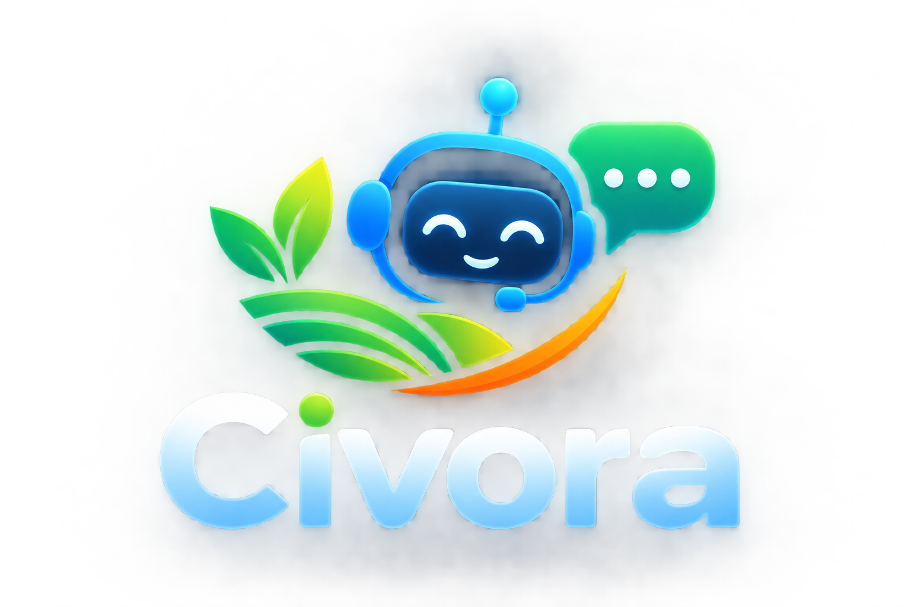

# Civora

A multilingual AI assistant for cooperative services and rural support.

<p align="center">
  
</p>

---

## Overview

Civora is an AI-powered multilingual assistance platform designed to help users understand cooperative services, government schemes, legal information, documents and grievance processes through conversational, voice and document-based interactions.

It bridges the information and governance accessibility gap for cooperative society members across India, including Primary Agricultural Credit Societies (PACS), dairy cooperatives, and multi-state cooperative societies.

---

## Key Capabilities

- **Multilingual conversational assistance**: Natural language chat support across 5 Indian languages (English, Tamil, Hindi, Telugu, Kannada).
- **Voice interaction**: Hands-free voice input and audio playback powered by the Web Speech API and Indic phonetic speech synthesis.
- **Document understanding & OCR**: Structured extraction of metadata from cooperative passbooks, land records (Patta/Chitta), and loan documents.
- **Knowledge retrieval**: Semantic and keyword retrieval grounded in cooperative acts, rules, and published government scheme guidelines.
- **Evidence-based responses & Source citations**: Generates answers with verified statutory citations (act names, sections, and rule clauses).
- **Context-aware assistance & Jurisdiction routing**: Automatically routes queries between Central (Multi-State Co-operative Societies Act, 2002) and State-specific Cooperative Societies Acts.
- **Scheme information & Eligibility checking**: Explains central and state cooperative welfare schemes with automated criterion evaluation.
- **Grievance assistance**: Drafts structured formal legal representations with applicable statutory citations addressed to the competent Deputy Registrar.
- **Tactile Kiosk Mode**: Touch-first, high-contrast, large-button interface designed for rural Common Service Centres (CSCs) and village PACS.
- **Human review workflow & PII Protection**: Flags low-confidence queries for human review and masks sensitive citizen identifiers.

---

## Architecture

```
User
  │
  ▼
Access Channels (Web Portal / Rural Touch Kiosk / Voice Modal)
  │
  ▼
Input Processing & Sanitization (Rate Limiting / PII Masking)
  │
  ▼
Language & Intent Understanding (Unicode Script Detection / Intent Classifier)
  │
  ▼
Context / Jurisdiction Processing (Central MSCS Act 2002 vs State Acts)
  │
  ▼
Knowledge Retrieval (Hybrid Dense + Sparse Statutory Knowledge Base)
  │
  ▼
Evidence Validation (Citation Section Verification / SHA-256 Hashing)
  │
  ▼
Response Generation (Grounded Answer Synthesis with Citations)
  │
  ▼
Action / Assistance (Document Summaries / Formal Grievance Drafter)
  │
  ▼
Human Review & Feedback Loop
```

---

## Technology Stack

- **Backend**: Python 3.10+, FastAPI, Pydantic v2, SQLAlchemy ORM, Uvicorn
- **Frontend**: React 19, TypeScript, Vite, Vanilla CSS Design System, Lucide Icons
- **Voice & Multilingual**: Web Speech API, Unicode Block Range Detector, Indic phonetic audio synthesis
- **Testing & Tooling**: Pytest, ESLint / Oxlint, Docker, Docker Compose

---

## Repository Structure

```
Civora/
├── backend/                  # FastAPI Python backend services
│   ├── app/
│   │   ├── api/routes/       # REST API endpoints (chat, documents, grievances, speech, health)
│   │   ├── core/             # Configuration, logging, security & PII sanitization
│   │   ├── domain/           # Pure domain entities
│   │   ├── evidence/         # Evidence provenance & rule validation engine
│   │   ├── grievance/        # Statutory representation templates
│   │   ├── integrations/     # External service adapters (Bhashini, Qdrant, DigiLocker)
│   │   ├── jurisdiction/     # Dual-tier Central vs State jurisdiction resolver
│   │   ├── models/           # SQLAlchemy ORM database models
│   │   ├── multilingual/     # Script detection & translation interfaces
│   │   ├── ocr/              # Document OCR & key-value parsing engine
│   │   ├── rag/              # Retrieval, embedding & citation validator
│   │   ├── repositories/     # In-memory and SQL repository layer
│   │   ├── schemas/          # Pydantic request/response validation schemas
│   │   └── services/         # Layered service implementations
│   └── tests/                # Automated pytest test suite
├── frontend/                 # React 19 + TypeScript + Vite web client
│   ├── src/
│   │   ├── components/       # UI components (ChatWorkspace, KioskUI, GrievanceWizard, etc.)
│   │   ├── constants/        # Knowledge datasets and 5-language translation sets
│   │   ├── hooks/            # useLanguage, speech recognition, audio management
│   │   ├── services/         # Typed API client with offline mock fallback
│   │   └── types/            # TypeScript interfaces
├── data/                     # Sample schemes, statutory provisions, and evaluation benchmarks
├── docs/                     # Documentation (Architecture, Capabilities, API, Dev, Deployment)
├── scripts/                  # Cross-platform development and test scripts
├── .env.example              # Environment configuration template
├── docker-compose.yml        # Container orchestration
└── LICENSE                   # MIT License
```

---

## Local Development

### Prerequisites
- Node.js v18+ or v20+ LTS
- Python 3.10+

### Option 1: Automated Script Runner

#### On Windows (PowerShell):
```powershell
# Run full automated test suite
.\scripts\test.ps1

# Start development servers (Backend on :8000 + Frontend on :5173)
.\scripts\dev.ps1
```

#### On Linux / macOS (Bash):
```bash
chmod +x scripts/*.sh
./scripts/test.sh
./scripts/dev.sh
```

---

### Option 2: Manual Setup

#### 1. Backend (FastAPI)
```bash
python -m venv venv
# Windows:
.\venv\Scripts\Activate.ps1
# Linux/macOS:
source venv/bin/activate

pip install -r backend/requirements.txt
python -m pytest backend/tests -v
uvicorn backend.app.main:app --reload --port 8000
```
Interactive API documentation: `http://localhost:8000/docs`

#### 2. Frontend (React 19 + Vite)
```bash
npm install
npm run build
npm run dev
```
Open `http://localhost:5173` in your browser.

---

## Configuration

Copy `.env.example` to `.env` and configure variables as needed:

```bash
cp .env.example .env
```

Key environment variables:
- `APP_MODE`: Runtime mode (`development`, `production`, `testing`)
- `HOST` / `PORT`: Backend server binding (default `0.0.0.0:8000`)
- `DATABASE_URL`: Relational database connection string (SQLite for dev, PostgreSQL for production)
- `LLM_PROVIDER`: Provider toggle (`mock`, `openai`, `google`)
- `OCR_PROVIDER`: Document extraction provider (`mock`, `paddleocr`, `tesseract`)
- `ASR_PROVIDER` / `TTS_PROVIDER`: Speech services provider (`mock`, `indic_asr`, `whisper`)

---

## API

Civora exposes a structured REST API under `/api/v1`:

- `GET /api/v1/health` — System status, environment mode, and provider health.
- `POST /api/v1/chat/` — Conversational assistance query with jurisdiction resolution and citations.
- `POST /api/v1/documents/analyze` — Document upload, OCR extraction, and field parsing.
- `POST /api/v1/grievances/draft` — Statutory grievance representation drafter.
- `POST /api/v1/speech/transcribe` — Speech-to-text audio transcription.
- `POST /api/v1/speech/synthesize` — Text-to-speech audio synthesis.

See [`docs/API_REFERENCE.md`](docs/API_REFERENCE.md) for full endpoint specifications.

---

## Testing

Run all unit and integration tests across both backend and frontend:

```bash
# Run all tests
npm test

# Run backend pytest only
python -m pytest backend/tests -v

# Run frontend build validation only
npm run build
```

---

## Docker Deployment

Build and run Civora using Docker Compose:

```bash
docker compose up --build -d
```
- Frontend: `http://localhost:5173`
- Backend API: `http://localhost:8000/api/v1`
- Swagger Documentation: `http://localhost:8000/docs`

---

## Demo Mode

When running with `APP_MODE=development` (default), Civora operates in **Demo Mode**:
- In-memory mock service providers are used for LLM generation, OCR extraction, and speech synthesis without requiring external paid API keys.
- The frontend features automatic fallback to local datasets if the backend server is unreachable, ensuring a smooth offline evaluation experience.

---

## Limitations

- **Live Government Database Synchronization**: Currently utilizes seeded statutory acts and published scheme guidelines; live API connectors to state cooperative registrar databases require official department authorization.
- **Physical Document Verification**: Civora extracts and validates document metadata against statutory criteria, but official verification must be performed by the competent Registrar of Cooperative Societies.
- **Advisory Representation Drafts**: Grievance outputs are advisory representations for the user to review, sign, and submit through official channels.

---

## Roadmap

- [ ] **On-Device Indic Models**: Integration of lightweight IndicTrans2 and Whisper edge models for zero-connectivity rural kiosk operation.
- [ ] **DigiLocker Integration**: Direct citizen document fetching via DigiLocker OAuth sandbox.
- [ ] **State Acts Expansion**: Extended coverage of cooperative acts for additional Indian states and Union Territories.
- [ ] **Voice-Interactive Kiosk Audio**: Full bidirectional voice streaming over WebSocket channels.

---

## License

Civora is released under the [MIT License](LICENSE).
